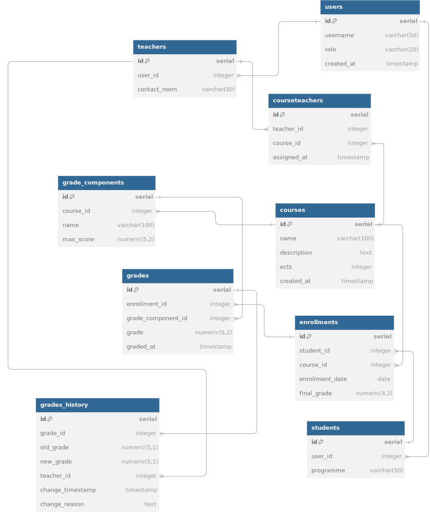

<p align="center">
    
</p>
<p align="center"><h1 align="center">POSTGRES-STUDENT-GRADES-PROJECT</h1></p>
<p align="center">
	<em><code>Made by Ozoq</code></em>
</p>

---

## Overview

<code>❯ A management tool for a university. Manage courses. Manage user accounts for teachers and students. See and change grades.</code>

---

## Features

<code>❯ Create students and teachers, create courses, setup courses with grade components (tests, exams),
assign users their grades, automatically calculate their final grades for courses, view their accumulated ECTS and GPA.</code>

---

## Project Structure

```sh
└── postgres-student-grades-project/
    ├── app.js
    ├── cli.js
    ├── package-lock.json
    ├── package.json
    ├── setup.js
    ├── sql
    │   ├── create-tables.sql
    │   ├── functions.sql
    │   ├── procedures.sql
    │   ├── seed.sql
    │   └── triggers.sql
    └── src
        ├── config.js
        ├── dbClient.js
        ├── dbHelpers.js
        └── utils.js
```

## Table relations diagram


<br><br>
---

## Getting Started

### Prerequisites

Have node.js and npm installed.
Have postgres instance available.

### Installation

Install postgres-student-grades-project using one of the following methods:

**Build from source:**

1. Clone the postgres-student-grades-project repository:

```sh
❯ git clone https://github.com/ozoq/postgres-student-grades-project postgres-student-grades-project
Or from another repo on a GitLab mirror
```

2. Navigate to the project directory:

```sh
❯ cd postgres-student-grades-project
```

3. Install the project dependencies:

**Using `npm`** &nbsp; [](https://www.npmjs.com/)

```sh
❯ npm install
```

4. Edit `src/config.js` with your postgres configuration:

```js
export default {
  user: "postgres",
  host: "localhost",
  database: "projdb4", // Database will be auto-created
  password: "postgres",
  port: 5432,
};
```

### Usage

Run postgres-student-grades-project using the following command:
**Using `npm`** &nbsp; [](https://www.npmjs.com/)

1. To run the `.sql` files to setup the tables, functions, procedures, triggers and seed the database

```sh
❯ npm run setup
```

2. To see the contents of tables (So no need to use an external table viewer tool)

```sh
❯ npm run cli
```

3. To run an interactive program (application)

```sh
❯ npm run app
```
